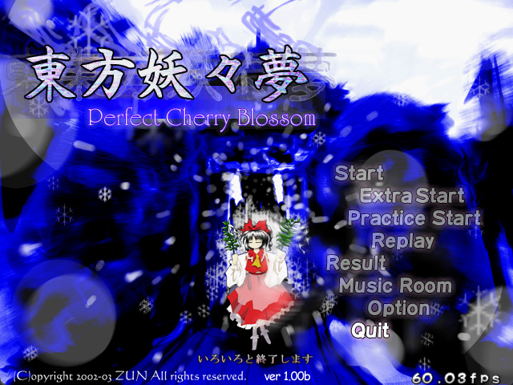
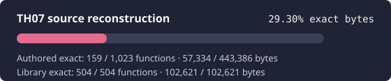

# 東方妖々夢 ～ Perfect Cherry Blossom

<p align="center">
  
</p>

<p align="center">
  
</p>

This project aims to reconstruct the source code of the original Japanese
`東方妖々夢 ～ Perfect Cherry Blossom` version 1.00b executable, with
reproducible binary comparison as the acceptance criterion.

The project is in active reverse engineering. The initial IDA inventory is
tracked in a machine-readable function ledger; a routine is counted as
reconstructed only after a 100% function-byte comparison. The workflow combines
the adjacent-engine knowledge in [GensokyoClub/th06](https://github.com/GensokyoClub/th06)
and [GensokyoClub/th08](https://github.com/GensokyoClub/th08) with strict target,
evidence, claim, and comparison gates derived from the TH10.5 reconstruction.

## Target executable

Supply your own original executable as `resources/th07.exe`:

| Property | Required value |
| --- | --- |
| Version | Original Japanese 1.00b |
| Size | `650,752` bytes |
| SHA-256 | `35467eaf8dc7fc85f024f16fb2037255f151cefda33cf4867bc9122aaa2e80ca` |
| PE image base | `0x00400000` |

Localized or patched executables are different binaries and are intentionally
rejected. The executable and game data are copyrighted assets and are not
included. The target identity also agrees with the
[thpatch version manifest](https://www.thpatch.net/wiki/Patch:Base_TSA/Versions).

```bash
python3 scripts/verify-target.py
```

## Reverse-engineering environment

IDA Pro MCP is the preferred semantic-analysis backend. Every session fails
closed unless the IDA window is attached to the exact target above. The helper
uses the project-independent `ida-pro-mcp` registration and never hard-codes a
local IDA installation path.

```bash
python3 scripts/check-ida-mcp.py
python3 scripts/export-ida-inventory.py
python3 scripts/validate-tracking.py
python3 scripts/progress.py --check
```

The local `_references/th06` and `_references/th08` clones are intentionally
ignored. Their source is supporting evidence, never a substitute for TH07
instructions, data layout, or exact comparison.

## Project map

- [Architecture and current binary facts](docs/ARCHITECTURE.md)
- [Reverse-engineering workflow](docs/RE_WORKFLOW.md)
- [IDA-first analysis](docs/IDA_MCP.md)
- [Build and matching plan](docs/BUILD_MATCHING.md)
- [Prebuilt D3DX8 and VC7 runtime recovery](docs/LIBRARY_RECOVERY.md)
- [Workflow evolution and parallel gates](docs/WORKFLOW_EVOLUTION.md)
- [Generated progress](docs/PROGRESS.md)
- [Agent operating rules](AGENTS.md)

## Build status

The PE linker metadata and Rich header identify Visual C++ .NET 2002 (VC7,
build 9466), matching the toolchain family used by the TH06 and TH08 reference
projects. A matching full executable is not yet advertised; reconstruction
starts with address-bounded translation units and function-level comparison.
The current VC7 probes reconstruct 55 `TextHelper`, MIDI, DirectSound,
Controller, ScreenEffect, BulletManager, Player, and Chain functions exactly
(8,686/8,686 compared bytes). They remain focused probes rather than
assertions about the original object boundaries.

## License

Repository-authored code and documentation are provided under the MIT License.
This does not grant rights to the original game or its assets. Adjacent-version
reference code retains the license of its source repository.
